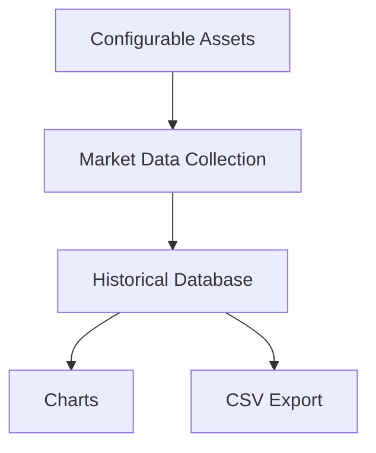
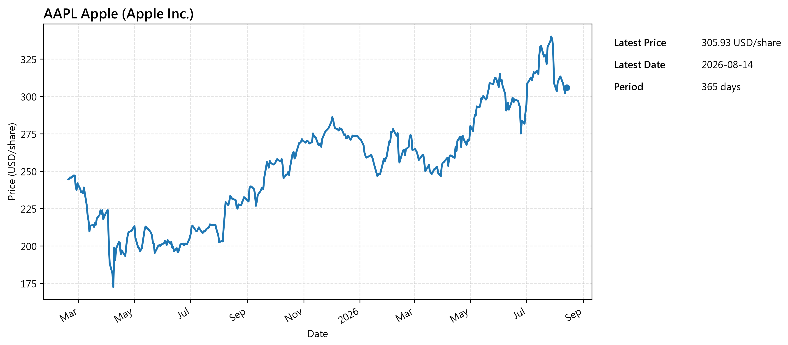
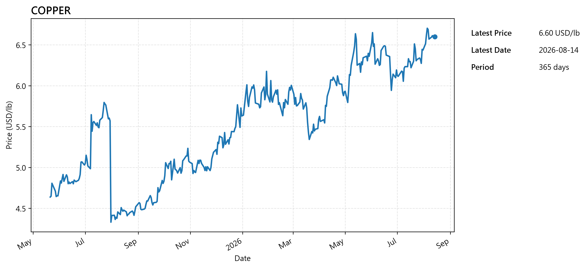

# MarketCapture

MarketCapture turns monthly manual screenshots into a reusable historical market record.

It continuously collects and stores historical market data, keeping a clean record for future reference and comparison.

When needed, the data can be exported as CSV files or visualized through clear and consistent charts.

## Design Rationale

MarketCapture uses a local database to continuously accumulate historical market data instead of treating each data collection as a standalone snapshot.

The purpose is to preserve data that may not be immediately needed, but can become useful later for comparison, analysis, or reference.

This approach also allows new data to be added incrementally while keeping the accumulated historical record available for future use.

## Features

- Automatically collects and stores historical market data from configurable financial assets.
- Exports data as CSV files for future reference, analysis, and use in other tools.
- Visualizes historical market trends through clear and consistent charts.

## Architecture



MarketCapture collects historical market data from configurable assets, stores it as a reusable historical record, and makes it available through charts and CSV exports.

## Project Structure

```text
MarketCapture/
├── database/
│   └── database.py       # Database management
├── graph/
│   └── graph.py          # Chart generation
├── output/
│   ├── stock/            # Stock chart output
│   └── commodity/        # Commodity chart output
├── collector.py          # Market data collection
├── config.py             # Configuration loader
├── main.py               # Main entry point
├── settings.json         # User-defined settings
├── requirements.txt      # Python dependencies
├── .gitignore
├── LICENSE
└── README.md
```

## Installation

1. Install Python.
2. Clone or download this repository.
3. Install the required packages:

```bash
pip install -r requirements.txt
```

## Configuration

Target assets, database paths, output paths, and the historical period can be configured in `settings.json`.

The sample configuration includes stocks, an index, and a commodity. Additional assets can be added by following the same structure.

## Usage

Run the main program:

```bash
python main.py
```

MarketCapture collects the configured market data, updates the historical database, and generates charts and CSV files in the configured output directories.

## Sample Output

### Stock



### Commodity



## License

This project is licensed under the MIT License.